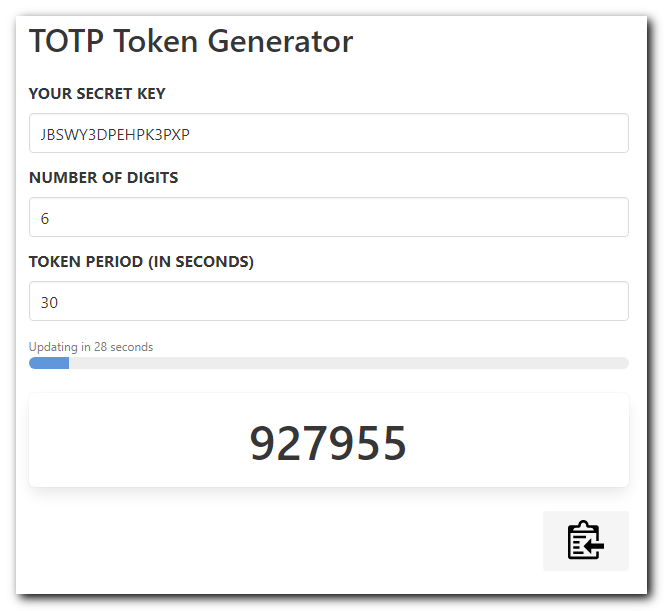

# 2FA登录验证码获取器 (支持用户系统)

> 📚 **快速导航**: 不知道从哪里开始？查看 [文档导航索引](DOCS_INDEX.md) 找到适合您的教程！



这是一个基于Web的时间验证码(TOTP)生成器，现在支持用户注册登录功能，可以将您的2FA密钥安全地保存在云端。

## ✨ 新功能特性

### 🔐 用户系统
- **用户注册和登录**: 创建个人账户，使用用户名和密码
- **密码管理**: 支持用户修改密码功能
- **云端存储**: 密钥自动保存到Cloudflare D1数据库，永不丢失
- **数据迁移**: 自动将浏览器本地数据迁移到云端账户
- **会话管理**: 安全的登录状态管理，支持多设备同步

### 🛡️ 安全特性
- **密码哈希**: 使用SHA-256安全哈希存储密码
- **JWT认证**: 基于令牌的身份验证
- **数据隔离**: 每个用户的密钥完全隔离
- **会话过期**: 自动会话管理，提高安全性

### ✨ 密钥管理
- **添加密钥**: 支持手动输入或扫描二维码添加TOTP密钥
- **编辑密钥**: 修改密钥名称、用户名等信息
- **删除密钥**: 安全删除不需要的密钥
- **一键复制**: 快速复制验证码到剪贴板
- **自动刷新**: 验证码自动更新，显示倒计时

## 🚀 快速开始

### 对于新用户
1. 点击"注册"创建新账户
2. 使用用户名和密码登录
3. 添加您的2FA密钥，自动保存到云端
4. 在任何设备上登录即可访问您的密钥

### 对于现有用户
1. 如果您之前使用过本地版本，先注册新账户
2. 登录后系统会自动检测本地密钥
3. 选择"迁移到云端"将现有密钥转移到账户
4. 享受云端同步的便利

## 🛠️ 部署指南

### 🎯 推荐方式：可视化部署（15分钟）
**无需命令行，通过Cloudflare Dashboard完成所有操作**

📖 **详细教程**: [可视化部署指南](VISUAL_DEPLOYMENT_GUIDE.md)  
✅ **快速检查**: [部署检查清单](QUICK_DEPLOY_CHECKLIST.md)  
📸 **截图说明**: [可视化截图指南](VISUAL_SCREENSHOTS_GUIDE.md)

### 环境要求
- Cloudflare账户（免费即可）
- GitHub账户
- 15-20分钟时间

### 🚀 快速开始
1. **准备项目**: 将代码上传到GitHub
2. **创建Pages**: 在Cloudflare连接GitHub仓库
3. **设置数据库**: 创建D1数据库并初始化表
4. **配置存储**: 创建KV命名空间
5. **绑定资源**: 配置D1和KV绑定
6. **测试功能**: 验证用户注册登录

### 🔧 命令行部署（高级用户）
如果您熟悉命令行操作：

```bash
git clone <repository-url>
cd 2fa
./setup.sh  # 自动设置脚本
npm run dev # 本地开发
npm run deploy # 部署到生产
```

详细命令行说明请查看 [DEPLOYMENT.md](DEPLOYMENT.md)

## 🔧 技术架构

### 前端
- **Vue.js 3**: 现代响应式前端框架
- **Bulma CSS**: 美观的UI组件库
- **OTPAuth**: 强大的TOTP生成库

### 后端
- **Cloudflare Pages Functions**: 无服务器API
- **Cloudflare D1**: SQL数据库存储用户和密钥
- **Cloudflare KV**: 会话状态管理

### 安全
- **SHA-256密码哈希**: 安全的密码存储
- **JWT令牌认证**: 无状态身份验证
- **HTTPS传输**: 端到端加密通信

## 📖 使用说明

### 密钥格式支持
- `密钥`: 直接输入Base32格式的密钥
- `名称:密钥`: 为密钥指定名称
- `名称\t密钥`: 使用制表符分隔(从Excel等复制时)

### 批量添加
在文本框中每行输入一个密钥，支持：
```
ABCDEFGHIJKLMNOP
Google:QRSTUVWXYZ123456
Microsoft	ABCD1234EFGH5678
```

### QR码功能
- 点击密钥下方的QR码图标
- 使用手机验证器APP扫描
- 自动导入到手机应用

## 🤝 兼容性

本生成器与以下验证器应用完全兼容：
- Google Authenticator
- Microsoft Authenticator
- Authy
- 1Password
- LastPass Authenticator
- 其他符合RFC 6238标准的TOTP应用

## 📝 API文档

### 用户认证
- `POST /api/register` - 用户注册
- `POST /api/login` - 用户登录
- `POST /api/logout` - 用户注销

### 密钥管理
- `GET /api/keys` - 获取用户密钥
- `POST /api/keys` - 添加密钥
- `POST /api/keys/batch` - 批量添加
- `PUT /api/keys/{id}` - 更新密钥
- `DELETE /api/keys/{id}` - 删除密钥

## 🔒 隐私声明

- 您的密钥使用企业级加密存储在Cloudflare的安全数据中心
- 我们不会访问、分析或共享您的2FA密钥
- 所有数据传输都使用HTTPS加密
- 您可以随时导出或删除您的数据

## 📄 许可证

本项目基于原始开源项目开发，遵循相同的开源许可证。

## 🙏 致谢

- [otpauth](https://github.com/hectorm/otpauth) - 优秀的TOTP生成库
- [Vue.js](https://vuejs.org/) - 强大的前端框架
- [Cloudflare](https://www.cloudflare.com/) - 提供可靠的边缘计算服务
* https://randomoracle.wordpress.com/2017/02/15/extracting-otp-seeds-from-authy/
* https://gist.github.com/tresni/83b9181588c7393f6853
* https://gist.github.com/Ingramz/14a9c39f8c306a2d43b4
